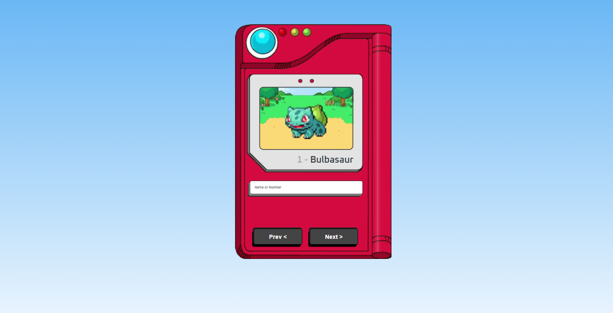

 
  

<!--  -->

<h2 align="center">Tecnologias 🚀</h2>
   

Esse projeto foi desenvolvido com as seguintes tecnologias:

- **HTML**
- **CSS**
- **Javascript**
- **Modularização**
- **Metodos Estaticos e Promessas**

  
  ---
  <h3 align="center">Projeto💻 </h3>
  
Acesse o projeto em <a href="https://micaela-marques.github.io/GitFav/"> site🌐
  

